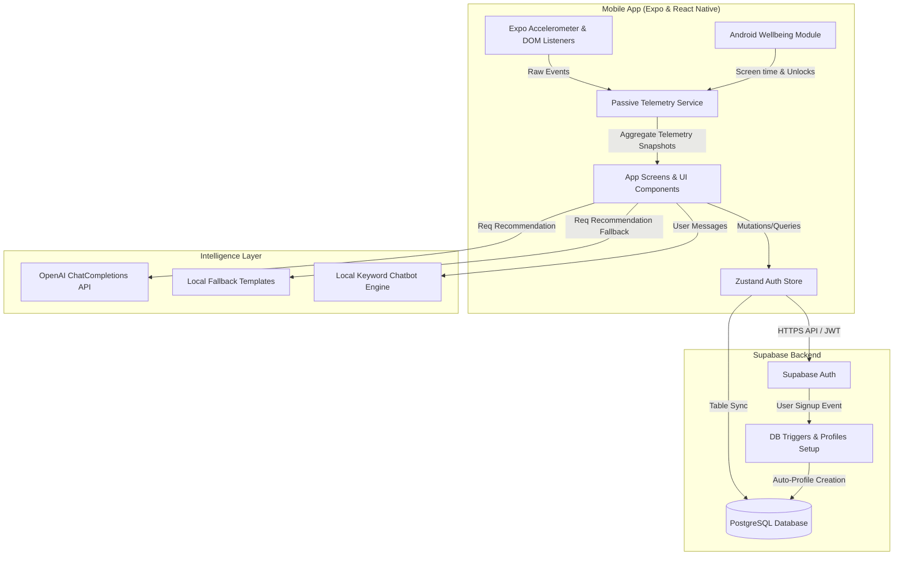

# MindTrace AI Wellness System — Architecture & Working Guide

MindTrace AI is a mobile-first, privacy-respecting wellness platform designed to passively monitor behavioral and mental health telemetry signals and surface actionable clinical insights without intrusive surveillance. Its design philosophy and aesthetic personality is **"The Quiet Observer"** — clinical, serene, precise, and supportive.

This document provides a comprehensive technical walkthrough of how the MindTrace application functions, detailing its directories, data schemas, passive analytics calculations, recommendation pipeline, and local state management.

---

## 1. System Architecture



---

## 2. Directory Structure & Codebase Map

Here is the functional map of the MindTrace AI project directory:

- [app/](file:///c:/Users/HP/.cursor/MCPSTICH/app/) — Expo Router navigation screens and layouts.
  - [app/_layout.tsx](file:///c:/Users/HP/.cursor/MCPSTICH/app/_layout.tsx) — Root application structure, theme configurations, and font loader.
  - [app/index.tsx](file:///c:/Users/HP/.cursor/MCPSTICH/app/index.tsx) — Splash Screen that checks session validation and forwards users to login, onboarding, or the dashboard.
  - [app/(auth)/](file:///c:/Users/HP/.cursor/MCPSTICH/app/(auth)/) — Directory for authentication paths:
    - [login.tsx](file:///c:/Users/HP/.cursor/MCPSTICH/app/(auth)/login.tsx) — Secure session sign-in.
    - [signup.tsx](file:///c:/Users/HP/.cursor/MCPSTICH/app/(auth)/signup.tsx) — New profile creation.
    - [forgot-password.tsx](file:///c:/Users/HP/.cursor/MCPSTICH/app/(auth)/forgot-password.tsx) — Password recovery.
  - [app/(onboarding)/](file:///c:/Users/HP/.cursor/MCPSTICH/app/(onboarding)/) — Interactive flows:
    - [privacy.tsx](file:///c:/Users/HP/.cursor/MCPSTICH/app/(onboarding)/privacy.tsx) — Gatekeeper for collecting explicit user consent on telemetry tracking.
  - [app/(tabs)/](file:///c:/Users/HP/.cursor/MCPSTICH/app/(tabs)/) — Core client workspaces:
    - [_layout.tsx](file:///c:/Users/HP/.cursor/MCPSTICH/app/(tabs)/_layout.tsx) — Configures custom glassmorphism Bottom Nav bar.
    - [dashboard.tsx](file:///c:/Users/HP/.cursor/MCPSTICH/app/(tabs)/dashboard.tsx) — Main behavioral dashboard displaying metric scores and biomarkers.
    - [chat.tsx](file:///c:/Users/HP/.cursor/MCPSTICH/app/(tabs)/chat.tsx) — Anxious grounding AI conversation companion.
    - [breath.tsx](file:///c:/Users/HP/.cursor/MCPSTICH/app/(tabs)/breath.tsx) — Breathing/box-work exercise timer.
    - [recommendations.tsx](file:///c:/Users/HP/.cursor/MCPSTICH/app/(tabs)/recommendations.tsx) — Personalized recovery suggestions list.
    - [exercises.tsx](file:///c:/Users/HP/.cursor/MCPSTICH/app/(tabs)/exercises.tsx) — Catalog of interactive physical/mental guides.
    - [profile.tsx](file:///c:/Users/HP/.cursor/MCPSTICH/app/(tabs)/profile.tsx) — User accounts, settings, and privacy permissions toggles.
  - [app/ai-insights.tsx](file:///c:/Users/HP/.cursor/MCPSTICH/app/ai-insights.tsx) — Detail dashboard overlay that lists the telemetry scorecard and lists action steps with a session stopwatch.
  - [app/perfect-plan.tsx](file:///c:/Users/HP/.cursor/MCPSTICH/app/perfect-plan.tsx) — Formulates custom behavioral routines based on typing stress correlations.
  - [app/modal.tsx](file:///c:/Users/HP/.cursor/MCPSTICH/app/modal.tsx) — Detail graph breakdown for specific telemetry parameters.

- [src/](file:///c:/Users/HP/.cursor/MCPSTICH/src/) — Modular utilities, states, and database APIs.
  - [src/services/](file:///c:/Users/HP/.cursor/MCPSTICH/src/services/) — Communication layers:
    - [supabase.ts](file:///c:/Users/HP/.cursor/MCPSTICH/src/services/supabase.ts) — Configures Supabase Javascript Client with persistent AsyncStorage storage.
    - [auth.ts](file:///c:/Users/HP/.cursor/MCPSTICH/src/services/auth.ts) — Profile management and token authentication interface.
    - [realAnalytics.ts](file:///c:/Users/HP/.cursor/MCPSTICH/src/services/realAnalytics.ts) — Intercepts background user inputs, hardware movement sensors, and wellbeing APIs.
    - [wellness.ts](file:///c:/Users/HP/.cursor/MCPSTICH/src/services/wellness.ts) — Computes wellness indexes and tracks metrics.
    - [recommendations.ts](file:///c:/Users/HP/.cursor/MCPSTICH/src/services/recommendations.ts) — Compiles personalized wellness guides locally or via OpenAI.
    - [exercises.ts](file:///c:/Users/HP/.cursor/MCPSTICH/src/services/exercises.ts) — Library loader for custom exercises and action sequences.
    - [chatbot.ts](file:///c:/Users/HP/.cursor/MCPSTICH/src/services/chatbot.ts) — Crisis-filtering conversational parser.
  - [src/stores/](file:///c:/Users/HP/.cursor/MCPSTICH/src/stores/) — Shared Zustand stores:
    - [authStore.ts](file:///c:/Users/HP/.cursor/MCPSTICH/src/stores/authStore.ts) — Synchronizes local user profiles, theme toggles, and login states.
  - [src/components/](file:///c:/Users/HP/.cursor/MCPSTICH/src/components/) — Custom reusable interfaces:
    - [src/components/ui/](file:///c:/Users/HP/.cursor/MCPSTICH/src/components/ui/) — UI building blocks: [GlassCard](file:///c:/Users/HP/.cursor/MCPSTICH/src/components/ui/GlassCard.tsx), [PrimaryButton](file:///c:/Users/HP/.cursor/MCPSTICH/src/components/ui/PrimaryButton.tsx), [SecondaryButton](file:///c:/Users/HP/.cursor/MCPSTICH/src/components/ui/SecondaryButton.tsx), [InputField](file:///c:/Users/HP/.cursor/MCPSTICH/src/components/ui/InputField.tsx), and [StatusChip](file:///c:/Users/HP/.cursor/MCPSTICH/src/components/ui/StatusChip.tsx).
    - [src/components/dashboard/](file:///c:/Users/HP/.cursor/MCPSTICH/src/components/dashboard/) — Dashboard modules: [AIBiomarkersCard](file:///c:/Users/HP/.cursor/MCPSTICH/src/components/dashboard/AIBiomarkersCard.tsx), [JournalModal](file:///c:/Users/HP/.cursor/MCPSTICH/src/components/dashboard/JournalModal.tsx), [MeditationTimerModal](file:///c:/Users/HP/.cursor/MCPSTICH/src/components/dashboard/MeditationTimerModal.tsx), [MetricWidget](file:///c:/Users/HP/.cursor/MCPSTICH/src/components/dashboard/MetricWidget.tsx), and [WeeklyReportModal](file:///c:/Users/HP/.cursor/MCPSTICH/src/components/dashboard/WeeklyReportModal.tsx).
    - [src/components/charts/](file:///c:/Users/HP/.cursor/MCPSTICH/src/components/charts/) — Performance visuals: [GlowLineChart](file:///c:/Users/HP/.cursor/MCPSTICH/src/components/charts/GlowLineChart.tsx) and [Sparkline](file:///c:/Users/HP/.cursor/MCPSTICH/src/components/charts/Sparkline.tsx).
  - [modules/android-wellbeing/](file:///c:/Users/HP/.cursor/MCPSTICH/modules/android-wellbeing/) — Native Expo module exposing system usage stats directly from Android wellbeing APIs.

---

## 3. Core Engine Mechanics — "How it Works"

### 3.1. Passive Telemetry Engine
The application compiles telemetry signals inside [realAnalytics.ts](file:///c:/Users/HP/.cursor/MCPSTICH/src/services/realAnalytics.ts) across multiple sources:
- **Typing Mechanics**: Tracks keystroke timing intervals and correction rates. Input elements trigger [trackKeyPress](file:///c:/Users/HP/.cursor/MCPSTICH/src/services/realAnalytics.ts#L35) to measure backspaces and calculate the typing pace.
- **Device Sensors**: An accelerometer listener tracks active device movement patterns in the background (using [Expo Sensors](file:///c:/Users/HP/.cursor/MCPSTICH/src/services/realAnalytics.ts#L75)).
- **Web DOM Listeners**: On Web platforms, global event hooks capture mouse movements, scroll speed, and keypresses to calculate activity levels.
- **Native Android Wellbeing Integration**: Uses the custom [android-wellbeing module](file:///c:/Users/HP/.cursor/MCPSTICH/modules/android-wellbeing/index.ts) to query the device's system usage statistics. If granted permission, this retrieves true screen-on durations, unlock counts, and sleep gaps.
- **Sleep Logging**: Calculates sleep cycles by measuring background inactivity windows. If the app detects a gap of inactivity between 5 and 12 hours (e.g. overnight), it logs the duration as a sleep cycle.

#### Mathematical Calculations for Stress & Mood:
The system processes raw inputs via [getLiveMetrics](file:///c:/Users/HP/.cursor/MCPSTICH/src/services/realAnalytics.ts#L133):
- **Stress Index**: If keypresses are active, a typing cadence faster than 250ms (rushed) or slower than 600ms (hesitant) increases the stress index. An elevated backspace ratio (error correction rate) also adds to this score.
- **Mood Score**: Calculated by penalizing high backspace ratios and rewarding a steady, fluent typing speed (between 280ms and 450ms per key).
- **Inactivity Mode**: If typing logs are sparse, the system estimates indicators by correlating general app activity with sleep logs.

---

### 3.2. Zustand Local State & Supabase Hydration
Global states (including user accounts, theme profiles, and sync status) are managed via the [useAuthStore](file:///c:/Users/HP/.cursor/MCPSTICH/src/stores/authStore.ts#L33) Zustand hook.
- **Hydration**: On application startup, [app/_layout.tsx](file:///c:/Users/HP/.cursor/MCPSTICH/app/_layout.tsx#L56) calls `hydrate()` to check the active Supabase session. If verified, it fetches the user's profile and settings.
- **Sign Up**: Creating a user in Supabase Auth launches an database trigger `on_auth_user_created` that automatically generates corresponding rows in the `profiles` and `user_settings` tables.
- **Baseline Seeding**: To prevent empty interfaces, [ensureSnapshots](file:///c:/Users/HP/.cursor/MCPSTICH/src/services/wellness.ts#L27) automatically writes an initial zero baseline telemetry snapshot for new user accounts.

---

### 3.3. Personalization & AI Recommendation Pipeline
Personalized recovery options are handled via the [recommendations.ts](file:///c:/Users/HP/.cursor/MCPSTICH/src/services/recommendations.ts) service:
1. **Request Cycle**: When the client loads recommendations, [generateRecommendations](file:///c:/Users/HP/.cursor/MCPSTICH/src/services/recommendations.ts#L237) queries the latest telemetry parameters via [getWellnessSummary](file:///c:/Users/HP/.cursor/MCPSTICH/src/services/wellness.ts#L86).
2. **Stability Cache Check**: To optimize token usage and avoid redundant updates, the system compares the current telemetry snapshot with the previous entry. If metrics (sleep hours, mood score, stress index, and activity level) are stable within a small margin, it reuses the existing recommendations.
3. **AI Generation**:
   - If `EXPO_PUBLIC_OPENAI_API_KEY` is present, it uses `gpt-4o-mini` via [fetchOpenAIRecommendations](file:///c:/Users/HP/.cursor/MCPSTICH/src/services/recommendations.ts#L147) to compile personalized suggestions.
   - If the API key is missing or the request fails, it falls back to the rule-based [buildRecommendations](file:///c:/Users/HP/.cursor/MCPSTICH/src/services/recommendations.ts#L19) template compiler.
4. **Auto-Saving Exercises**: Exercises returned by the AI are extracted, formatted, and automatically saved to the user's personal exercise library via [saveAISuggestedExercises](file:///c:/Users/HP/.cursor/MCPSTICH/src/services/exercises.ts#L96).

---

### 3.4. Local AI Grounding Chatbot
The conversational chatbot interface in [chat.tsx](file:///c:/Users/HP/.cursor/MCPSTICH/app/(tabs)/chat.tsx) uses the [sendChatMessage](file:///c:/Users/HP/.cursor/MCPSTICH/src/services/chatbot.ts#L156) service:
- **Crisis Detection**: A safety filter scans incoming messages for self-harm keywords. If detected, it overrides the chat logic to display immediate crisis helpline contact details.
- **Local Sentiment Classifier**: Categorizes user inputs into emotion buckets (sadness, stress, anxiety, anger, loneliness, negative thinking, or low motivation) using keyword dictionaries.
- **Response Assembler**: Builds replies by pairing contextually relevant openers, insights, actionable suggestions, and supportive closings.
- **Clinical Disclaimer**: Appends a standard disclaimer to remind users that the assistant is an educational wellness aid, not a clinical therapy service.

---

## 4. Database Schema & Data Models

The system is built on a PostgreSQL database hosted on Supabase. Below are the key table structures:

### 4.1. `profiles` Table
Stores user profile information, linking directly to Supabase Auth accounts.
```sql
CREATE TABLE public.profiles (
    id UUID PRIMARY KEY REFERENCES auth.users ON DELETE CASCADE,
    display_name TEXT,
    avatar_url TEXT,
    onboarding_complete BOOLEAN DEFAULT FALSE,
    privacy_consent_at TIMESTAMPTZ,
    created_at TIMESTAMPTZ DEFAULT NOW()
);
```

### 4.2. `wellness_snapshots` Table
Records passive telemetry snapshots over time to display in charts and calculate trends.
```sql
CREATE TABLE public.wellness_snapshots (
    id UUID PRIMARY KEY DEFAULT gen_random_uuid(),
    user_id UUID NOT NULL REFERENCES public.profiles(id) ON DELETE CASCADE,
    recorded_at TIMESTAMPTZ DEFAULT NOW(),
    mood_score REAL DEFAULT 0.0,
    sleep_hours REAL DEFAULT 0.0,
    activity_level REAL DEFAULT 0.0,
    stress_index REAL DEFAULT 0.0,
    risk_level TEXT DEFAULT 'low', -- 'low' | 'medium' | 'high'
    metadata JSONB DEFAULT '{}'::jsonb
);
```

### 4.3. `recommendations` Table
Tracks active, AI-generated recovery recommendations.
```sql
CREATE TABLE public.recommendations (
    id UUID PRIMARY KEY DEFAULT gen_random_uuid(),
    user_id UUID NOT NULL REFERENCES public.profiles(id) ON DELETE CASCADE,
    title TEXT NOT NULL,
    body TEXT NOT NULL, -- JSON payload describing descriptions and step-by-step exercises
    category TEXT NOT NULL, -- 'sleep' | 'mindfulness' | 'activity' | 'general'
    priority INTEGER DEFAULT 3,
    generated_at TIMESTAMPTZ DEFAULT NOW(),
    dismissed BOOLEAN DEFAULT FALSE,
    completed BOOLEAN DEFAULT FALSE
);
```

### 4.4. `exercises` Table
Contains physical stretches, meditations, and breathing guides available in the user's library.
```sql
CREATE TABLE public.exercises (
    id UUID PRIMARY KEY DEFAULT gen_random_uuid(),
    user_id UUID NOT NULL REFERENCES public.profiles(id) ON DELETE CASCADE,
    name TEXT NOT NULL,
    duration TEXT NOT NULL,
    steps TEXT[] DEFAULT '{}'::text[],
    explanation TEXT,
    category TEXT NOT NULL,
    custom BOOLEAN DEFAULT TRUE,
    created_at TIMESTAMPTZ DEFAULT NOW()
);
```

### 4.5. `journals` Table
Stores wellness logs and mood tags entered by the user.
```sql
CREATE TABLE public.journals (
    id UUID PRIMARY KEY DEFAULT gen_random_uuid(),
    user_id UUID NOT NULL REFERENCES public.profiles(id) ON DELETE CASCADE,
    content TEXT NOT NULL,
    mood_score REAL NOT NULL,
    mood_tag TEXT NOT NULL,
    created_at TIMESTAMPTZ DEFAULT NOW()
);
```

### 4.6. `user_settings` Table
Keeps track of notification and privacy preferences.
```sql
CREATE TABLE public.user_settings (
    user_id UUID PRIMARY KEY REFERENCES public.profiles(id) ON DELETE CASCADE,
    notifications_enabled BOOLEAN DEFAULT TRUE,
    data_sharing_enabled BOOLEAN DEFAULT FALSE,
    theme TEXT DEFAULT 'light' -- 'light' | 'dark'
);
```

---

## 5. Development Guide & Quick Start

### 5.1. Environment Variables Configuration
Duplicate `.env.example` to `.env` in the root folder and configure the credentials:
```env
EXPO_PUBLIC_SUPABASE_URL=https://your-project.supabase.co
EXPO_PUBLIC_SUPABASE_KEY=eyJhbGciOiJIUzI1NiIsInR5cCI6IkpXVCJ9...
EXPO_PUBLIC_OPENAI_API_KEY=sk-proj-...
```

### 5.2. Running the Client
Install node packages and launch the build bundler:
```bash
# Install dependencies
npm install

# Start development client for Web
npm run web

# Start development client for Android Emulator
npm run android

# Start development client for iOS Simulator
npm run ios

# Open Expo CLI tools panel
npm start
```

---
*MindTrace AI — Quietly observing, gently guiding.*
